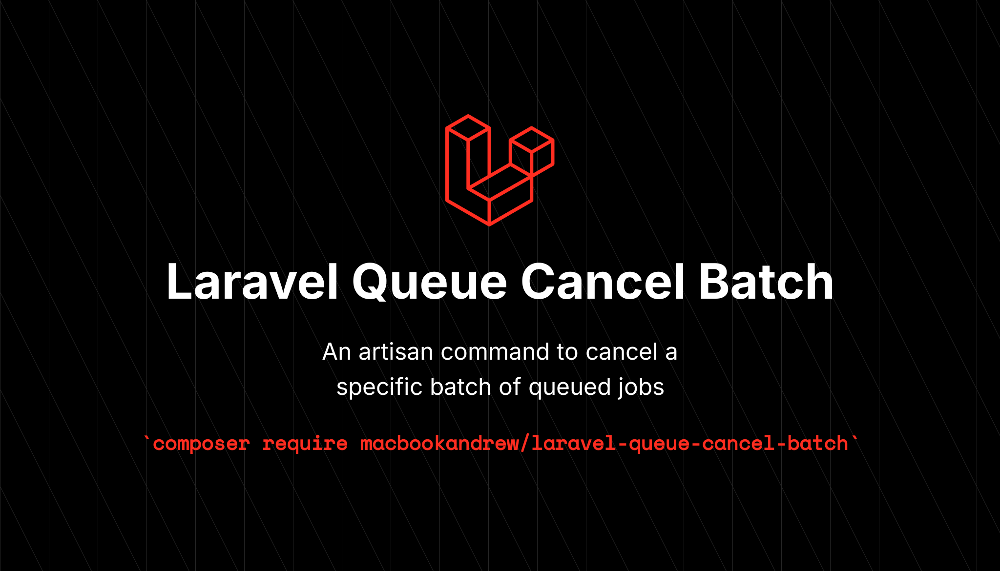

# Provides an Artisan command to cancel a queued batch of jobs



[](https://packagist.org/packages/macbookandrew/laravel-queue-cancel-batch)
[](https://github.com/macbookandrew/laravel-queue-cancel-batch/actions?query=workflow%3Arun-tests+branch%3Amain)
[](https://github.com/macbookandrew/laravel-queue-cancel-batch/actions?query=workflow%3A"Fix+PHP+code+style+issues"+branch%3Amain)
[](https://packagist.org/packages/macbookandrew/laravel-queue-cancel-batch)

This package provides a command to cancel a specific batch of queued jobs.

## Installation

You can install the package via composer:

```bash
composer require macbookandrew/laravel-queue-cancel-batch
```

## Usage

```shell
# search for active batches and chancel one or more
php artisan queue:cancel-batch

 ┌ Select one or more batches to cancel ─────────────────────────┐
 │ My Test Batch (44/56 completed jobs; started 3 seconds ago)   │
 │ My Test Batch 2 (12/56 completed jobs; started 1 second ago)  │
 └───────────────────────────────────────────────────────────────┘

# cancel a batch if you already have the batch ID
php artisan queue:cancel-batch 70045ad7-3279-4481-9b1e-012710f22221
```

## Testing

```bash
composer test
```

## Changelog

Please see [CHANGELOG](CHANGELOG.md) for more information on what has changed recently.

## Contributing

Please see [CONTRIBUTING](CONTRIBUTING.md) for details.

## Security Vulnerabilities

Please review [our security policy](../../security/policy) on how to report security vulnerabilities.

## Credits

- [Andrew Minion](https://github.com/macbookandrew)
- [All Contributors](../../contributors)

## License

The MIT License (MIT). Please see [License File](LICENSE.md) for more information.
